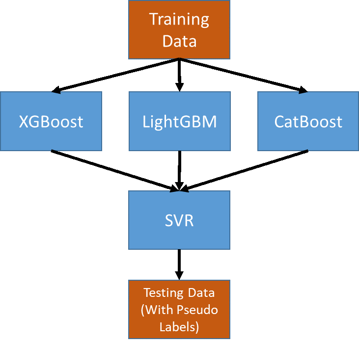
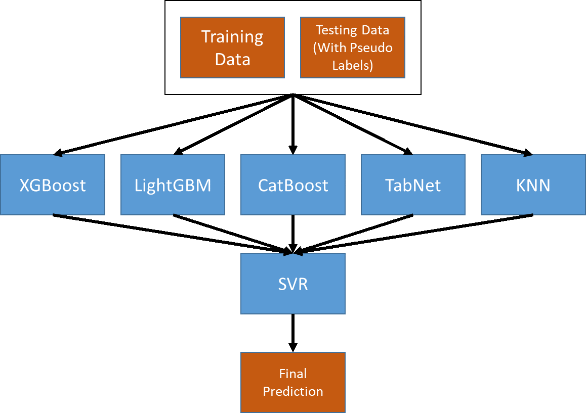
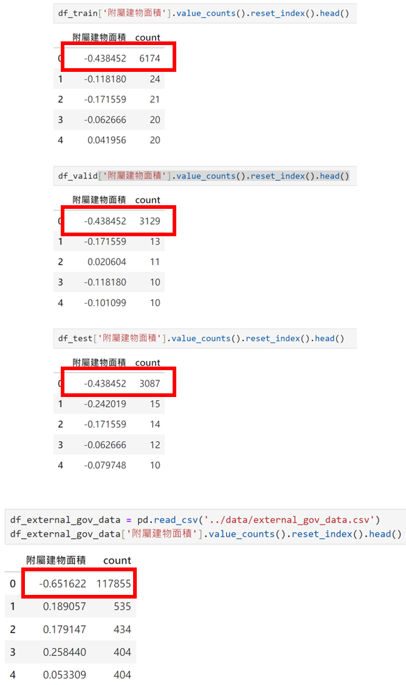

# 永豐AI GO競賽-攻房戰
## 隊伍：星之卡比
### 競賽說明：https://tbrain.trendmicro.com.tw/Competitions/Details/30
### 本Repo目錄結構
```shell
├── README.md
├── download_external_data.sh
├── feature_engineering.sh
├── main.sh
├── model_training_and_prediction.sh
├── preprocess_external_data.sh
├── requirements.txt
├── 外部資料集
│   └── 鄉鎮土地面積及人口密度(97).ods
├── 官方資料集
│   ├── external_data
│   │   ├── ATM資料.csv
│   │   ├── 便利商店.csv
│   │   ├── 公車站點資料.csv
│   │   ├── 國中基本資料.csv
│   │   ├── 國小基本資料.csv
│   │   ├── 大學基本資料.csv
│   │   ├── 捷運站點資料.csv
│   │   ├── 火車站點資料.csv
│   │   ├── 腳踏車站點資料.csv
│   │   ├── 郵局據點資料.csv
│   │   ├── 醫療機構基本資料.csv
│   │   ├── 金融機構基本資料.csv
│   │   └── 高中基本資料.csv
│   ├── private_dataset.csv
│   ├── public_dataset.csv
│   ├── public_private_submission_template.csv
│   ├── public_submission_template.csv
│   └── training_data.csv
├── 程式碼檔案
│   ├── EDA.ipynb
│   ├── feature_engineering_org.ipynb
│   ├── feature_engineering_refactoring.ipynb
│   ├── final_model.ipynb
│   ├── final_model.py
│   ├── preprocess_external_gov_data_by_year.ipynb
│   ├── preprocess_external_gov_data_lease.ipynb
│   ├── preprocess_external_gov_data_pre_sale.ipynb
│   ├── preprocess_external_gov_data_trade.ipynb
│   ├── preprocess_fire_department.ipynb
│   ├── preprocess_gas_station.ipynb
│   ├── preprocess_low_income.ipynb
│   ├── preprocess_police_office.ipynb
│   └── preprocess_population.ipynb
```
※ 因競賽條款此處未提供官方資料集

### 執行環境
- 伺服器環境
   ```shell
   Distributor ID: 	Ubuntu
   Description:    	Ubuntu 20.04.3 LTS
   Release:        	20.04
   Codename:           focal4
   ```
- Python環境與套件版本
   ```shell
   Python 3.11.5
- 我的硬體設備
   ```
   CPU:     AMD Ryzen 9 3900X 12-Core Processor
   GPU:     NVIDIA 2080Ti
   Memory:  64GB DDR4
   ```

※ 建議使用conda建立全新的python 3.11環境以避免套件相依與版本問題

### 0. 一鍵執行
- 請執行以下command，他將自動完成下列1 ~ 4個步驟的所有操作並輸出submission.csv，或者你也可以手動逐一執行
   ```shell
   sh main.sh
   ```

### 1. 相依套件
- 請執行以下command安裝需求套件 (~10 minutes)
   ```shell
   pip install -r requirements.txt
   ```

### 2. 外部資料集

- 請執行以下command進行資料下載 (~10 minutes)
   ```shell
   sh download_external_data.sh
   ```
   > ※ 因為資料下載問題，預設提供"鄉鎮土地面積及人口密度(97)"

   > ※ 因為資料更新問題，因此最終結果與我當初的會有非常非常小的落差，這點是正常的

   其中，本解決方案共使用到以下幾種類型的外部資料集：
   * 內政部不動產成交案件實際資訊資料供應系統 (使用2020Q1~2023Q3，CSV格式)
   * 各警察(分)局分駐(派出)所地址電話經緯度資料
   * 全國消防單位位置及災害應變中心位置
   * 台灣中油公司加油站服務資訊
   * 台糖加油站據點資訊
   * 鄉鎮土地面積及人口密度(97) 
   * 低收入戶戶數及人數按鄉鎮市區別分


### 3. 資料前處理

- 處理額外下載的資料集，請執行以下command (~5 minutes)
   ```shell
   sh preprocess_external_data.sh
   ```
- Feature Engineering，請執行以下command (~30 minutes)
   ```shell
   sh feature_engineering.sh
   ```
   > ※ 這是程式碼清理後的feature_engineering，從Local Cross Validation上來說會比當初的精準度更高(更低的MAPE)，如果有需要的話，可以執行`feature_engineering_org.ipynb`來獲得與我當初最佳提交相當的結果。

- 檢查輸出結果
   > 預期會有的輸出結果如下
   ```shell
   ll 官方資料集 | grep final_feature_engineering
   -rwxrwxrwx 1 root root 102586859 Nov 19 11:31 final_feature_engineering_train.csv*
   -rwxrwxrwx 1 root root 102506905 Nov 19 11:31 final_feature_engineering_valid.csv*
   ```

### 4. 模型訓練與預測 
- 模型訓練與預測，請執行以下command來獲得最終輸出`submission.csv` (~12 hr)
   ```shell
   sh model_training_and_prediction.sh
   ```
   基於過往的參賽以及實務經驗，我在這次比賽中使用了Pseudo Labels的競賽技巧，在第一階段中會透過SVR model對LightGBM、XGBoost、CatBoost三個模型的預測結果進行stacking，用以收斂預測。經過第一階段後，我們會得到帶有Pseudo Labels的testing data，這時候就會進入第二階段，透過training data + 帶有Pseudo Labels的testing data，來訓練LightGBM、XGBoost、CatBoost、TabNet、KNN這五個模型。
   
   其中，額外加入TabNet、KNN這兩個非樹模型的用意在於增加最終方案的Robustness，以達到最高的模型預測精度。
   而在本次競賽最佳的提交中，對於每一模型我都是先做了20-fold的Cross Validation Ensemble，才將其結果傳給SVR做stacking。詳細內容請參考程式碼會更為清楚。

   (因為時間關係，沒有特別做參數最優化。)

   

   (第一階段模型架構圖)

   

   (第二階段模型架構圖)
## 實驗成績筆記
| Model Name                  | K-folds | Pseudo Labels | Cross Validation | Public LB | Private LB | Memo |
|-----------------------------|---------|---------------|-------------------|-----------|------------|------|
| Model 2023110601            | 5       | No            | 7.0954            | 7.0084    | 6.6864     |      |
| Model 2023110602            | 5       | No            | 6.9612            | 6.9024    | 6.6245     |      |
| Model 20231107              | 10      | No            | 6.869             | 6.8415    | 6.5662     |      |
| Model 20231108              | 20      | No            | 6.7231            | 6.7254    | 6.5032     |      |
| Model 20231110              | 20      | No            | 6.5918            | 6.5967    | 6.3926     |      |
| Model 20231112              | 20      | No            | 6.3632            | 6.3141    | 6.1008     |      |
| Model 20231112              | 20      | Yes           | 6.0488            | 6.2868    | 6.0694     |      |
| Final Model                 | 20      | No            | 6.3538            | -         | -          | 如果想復現結果，請執行feature_engineering_org.ipynb + final_model.ipynb |
| Final Model                 | 20      | Yes           | 6.0106            | 6.2631    | 6.0388     | 如果想復現結果，請執行feature_engineering_org.ipynb + final_model.ipynb |
| Final Model Refactoring     | 20      | No            | 6.285             | -         | -          | 如果想復現結果，請執行feature_engineering_refactoring.ipynb + final_model.ipynb |
| Final Model Refactoring     | 20      | Yes           | 5.94*             | -         | -          | 如果想復現結果，請執行feature_engineering_refactoring.ipynb + final_model.ipynb |


### 比賽技巧簡述
- Cross Validation 與 Public LB 的趨勢非常接近，有助於本地實驗；從事後來看，也與Private leaderboard 趨勢接近。因此可以專注在提升Cross Validation，然後再提交
- 實驗時基本上是看LightGBM的表現，有變好再更新features或算法，因為LightGBM最快
- 善用Multi processing在特徵工程上有助於快速實驗
- 20-folds 可以提升單一模型的穩定性，5-folds結果較不穩定
- 實價登錄的資料與預測目標具有高度相關性(非常合理)，透過實價登錄資料，可以降低至少1%的成績 (e.g. 8.0 -> 7.0)
- 透過不同的資料對應、以及特徵間的統計計算(e.g. 同類型資料的相加/相減)方式，模型可以再降低0.3%左右的成績 (e.g. 7.0 -> 6.7)
- 根據LB回饋，Pseudo Labeling有助於降低0.03%左右的成績 (e.g. 6.7 -> 6.67)
- LightGBM + CatBoost + XGBoost 的ensemble可以降低0.2%左右的成績 (e.g. 6.67 -> 6.47)
- 加入非tree base模型(TabNet, KNN)對模型穩定性有幫助，同時也能小小降低MAPE (e.g. 6.47 -> 6.45)
- 針對官方資料的附屬建築物面積，以及實價登錄的附屬建築物面積對應(請見下圖，注意我在實價登錄的附屬建築物面積有先用StandardScaler做處理)，能再將低 0.2%左右的成績 (e.g. 6.45 -> 6.25)

   

   

   (附屬建築物面積比對圖)

   (透過比對附屬建築物面積，我們可以發現，大部分的附屬建築物面積應該都是0，因此可以簡單地將其分為是0的以及不是0的兩類來對應)